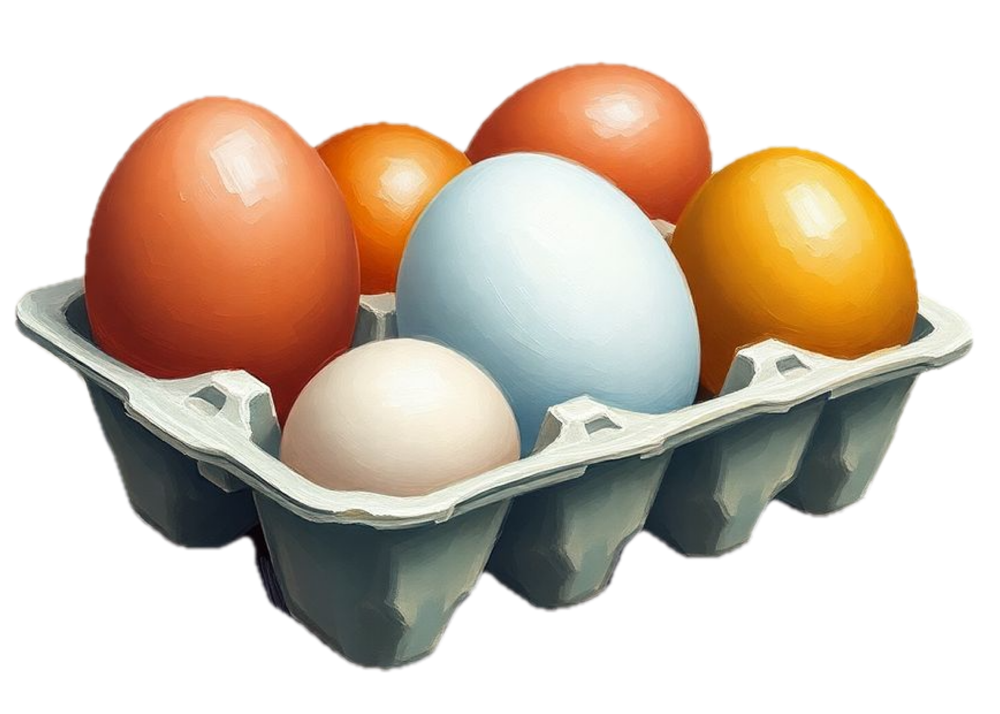

<div align="left">
    
</div>

# Nest

<div align="left">
    
  [](https://opensource.org/licenses/MIT)
    
</div>

Nest is an easy-to-use, lightweight asset management framework for iOS. It provides a simple and robust way to handle the storage, retrieval, and management of digital assets like images, videos, and metadata.

## Features

* 🪶 Lightweight and efficient
* 📂 Includes local file storage and CoreData integration.
* 🛠 Supports photos, videos, documents, and custom data types for asset management.
* 🔄 Asynchronous operations for optimal performance
* 🧩 Design for easy extension and flexibility

## Installation

Add **Nest** to your project using Swift Package Manager:

1. In Xcode, go to **File > Add Packages**
2. Enter the repository URL:
```
https://github.com/yyjim/Nest
```
3. Choose the version or branch and add it to your project

## Getting Started

Nest provides a convenient shared instance that uses `LocalStorage` for file management and `CoreData` for asset metadata management:

```swift
let nest = Nest.localShared
```

**Custom Initialization**

If you want to use a custom storage or database implementation, you can initialize the Nest framework with your own configurations:

```swift

let customStorage: NestStorage = CustomNestStorage()
let customDatabase: NestDatabase = CustomNestDatabase()

let nest = Nest(storage: customStorage, database: customDatabase)
````

## Asset Management

**Create a Data Asset**

```swift
let data = Data(repeating: 0, count: 1024)
let metadata: [String: MetadataValue] = ["format": .string("custom-format")]
// Create a new asset
let asset = try await nest.createAsset(data: data, type: .document, metadata: metadata)
```

**Fetch an Asset**

```swift
do {
    let fetchedAsset = try await nest.fetchAsset(assetIdentifier: assetIdentifier)
    let fetchedData = try await nest.fetchAssetData(assetIdentifier: assetIdentifier)
    print("Asset fetched successfully!")
} catch {
    print("Failed to fetch asset: \(error)")
}
```

**Update an Asset**

```swift
let updatedData = Data(repeating: 1, count: 2048)
let updatedMetadata: [String: MetadataValue] = ["format": .string("updated-format")]
// Update the asset
try await nest.updateAsset(assetIdentifier:assetIdentifier, data: updatedData, metadata: updatedMetadata)
```

**Delete an Asset**

```swift
try await nest.deleteAsset(assetIdentifier: assetIdentifier)
```

## Image Management

**Create a New Image**

```swift
let image = UIImage(named: "example")!
let format = ImageFormat.jpeg(quality: 0.8)
// Create a new image asset
let imageAsset = try await nest.create(image: image, format: format)
```

**Fetch an Image**

```swift
do {
    let image = try await nest.readImage(assetIdentifier: assetIdentifier)
    print("Image asset fetched successfully!")
} catch {
    print("Failed to fetch image asset: \(error)")
}
```

**Update an Image**

```swift
let updatedImage = UIImage(named: "updated-example")!
try await nest.update(assetIdentifier: assetIdentifier, image: updatedImage, format: .png)
```

**Delete an Image**

```swift
try await nest.deleteImage(assetIdentifier: assetIdentifier)
```

## Requirements

* iOS 16.0+
* Swift 5.7+

## Contributing

Contributions are welcome! Feel free to open issues or submit pull requests to improve the framework.

## License

Nest is available under the MIT license. See the LICENSE file for more details.
